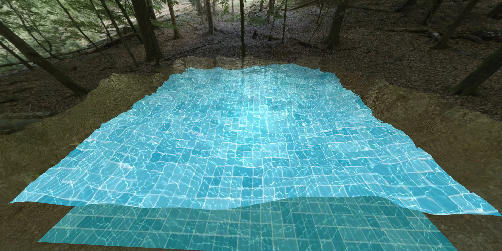

# OpenGL Water Simulation

<video controls src="https://github.com/user-attachments/assets/a716de31-95ca-495b-9716-c57b1c382276" title="Demo"></video>

#### Assignment PDF: [assignment.pdf](assignment.pdf)

### Water Height Function
The water heights map is generated using sum of radial sine waves with random centers, so that `amplitude * frequency` is constant (large waves have high amlitude and low frequency, and small waves have low amplitude and high frequency).

### Reflection + Refraction
+ The reflected ray is derived from law of reflection;
+ The refrected ray is calculated using [Snell's Law](https://en.wikipedia.org/wiki/Snell%27s_law);
+ The ratio between reflected and refracted light is calculated using [Schlick's approximation](https://en.wikipedia.org/wiki/Schlick%27s_approximation).

### Caustics
Caustics are drawn on the pool's bottom via rendering with additive blending. For each triangle of water mesh we calculate reflected ray, intersect it with the pool's bottom, and draw semi-transparent white pixel at the point of intersection. 

The alpha channel of this pixel depends on the ratio of areas of two projections of our triangle:
+ projection onto the surface orthogonal to sunlight direction;
+ projection onto the pool's bottom. 

So if some large triangle was projected onto small area on the pool's bottom, it will be brighter ([article](https://medium.com/@evanwallace/rendering-realtime-caustics-in-webgl-2a99a29a0b2c)).